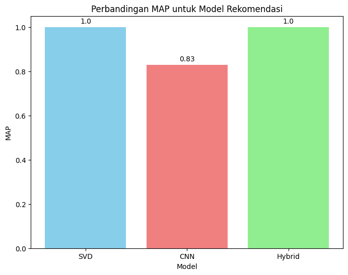
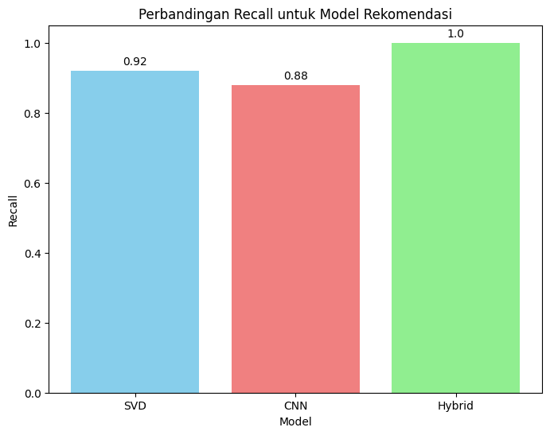
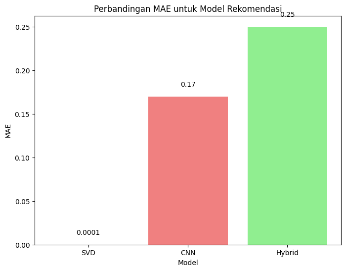
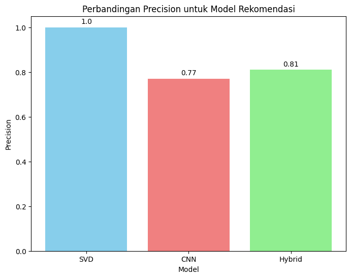
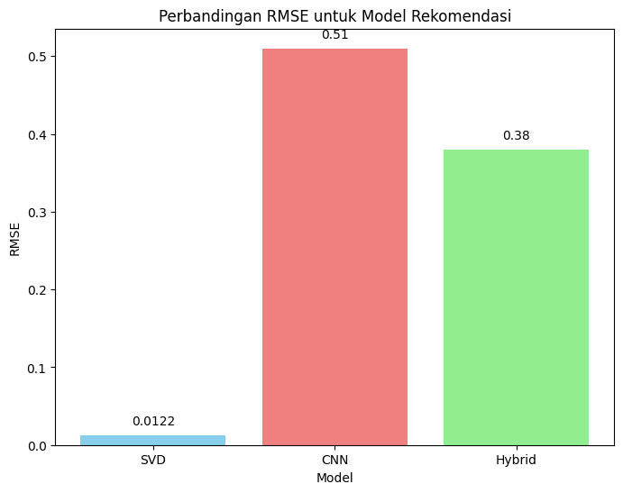

# Sistem Rekomendasi Tempat Wisata Toba

  

**NIM/Nama:**

- 12S210 - Dame Sitinjak
- 12S210 - Elshaday Simamora
- 12S21053 - Chesya Sitorus

# Model Pembanding
Model pembanding digunakan untuk mengevaluasi dan mengukur kinerja model utama dengan membandingkan hasil yang diperoleh dari keduanya. Tujuan utamanya adalah untuk menilai apakah model utama mampu memberikan hasil yang lebih baik atau lebih akurat dibandingkan dengan alternatif lainnya. Dengan menggunakan model pembanding, dapat diperoleh pemahaman yang lebih jelas tentang kelebihan dan kekurangan model utama, serta untuk menentukan apakah ada pendekatan yang lebih efektif dalam menyelesaikan masalah yang dihadapi. Proses perbandingan ini membantu dalam pengambilan keputusan terkait pemilihan model yang optimal berdasarkan kriteria evaluasi yang relevan.
Adapun model pembanding pada proyek kami ini adalah Model Convolutional neural network Model SVD dan untuk model utama adalah Model Hybrid Recommender Systems (CTF-IDF dan Cosine Similarity). Adapun perbandingan matrik evaluasi masing-masing model sebagai berikut:

